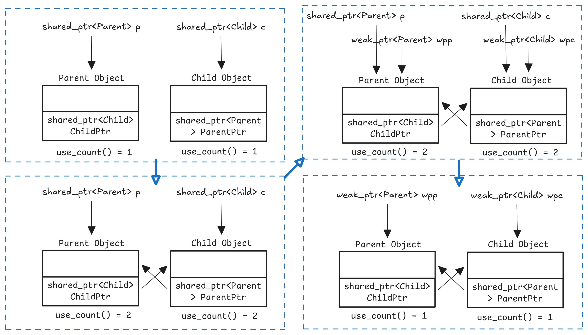

# 智能指针

## 1 什么是智能指针？
在C++中，有三种常用的智能指针：`std::unique_ptr`、`std::shared_ptr`、`std::weak_ptr`：
* `std::unique_ptr`是一种独占所有权的智能指针。它通过使用独占所有权的方式来管理资源，只能有一个`std::unique_ptr`指向同一个对象或数组。当`std::unique_ptr`超出作用域或被显式释放时，它会自动删除所管理的对象或数组。它通常用于表示独占的资源所有权，比如动态分配的单个对象或数组。
* `std::shared_ptr`是一种共享所有权的智能指针。它可以由多个`shared_ptr`指向同一个对象，通过引用计数来管理资源的生命周期。只有当最后一个`std::shared_ptr`超出作用域或被显式释放时，资源才会被删除。`std::shared_ptr`允许多个指针共享对同一资源的访问，通常用于表示共享的资源所有权。
* `std::weak_ptr`是一种弱引用的智能指针。它可以指向由`std::shared_ptr`管理的对象，但不会增加引用计数。`std::weak_ptr`主要用于解决`std::shared_ptr`的循环引用问题，通过`std::weak_ptr.lock()`方法可以获取一个有效的`std::shared_ptr`来访问被管理的对象。

## 2 `std::shared_ptr`
### 2.1 为什么要使用`std::shared_ptr`？
在传统的cpp编程中，使用`new`操作符分配的内存需要手动使用`delete`操作符释放，若忘记释放或者在异常情况下无法执行`delete`操作，就会造成内存泄漏。

`std::shared_ptr`可以自动处理内存的释放，当不再`std::shared_ptr`指向该对象时，对象的内存会被自动释放。

`std::shared_ptr`支持多个`std::shared_ptr`实例共享同一个对象的所有权。它通过引用计数机制来实现这一点，每个`std::shared_ptr`都会维护一个引用计数，记录有多少`std::shared_ptr`共享同一个对象。当引用计数变为0时，对象的内存会被释放。

```cpp
#include <iostream>
#include <memory>

class MyClass {
public:
    MyClass() {
        std::cout << "MyClass constructor" << std::endl;
    }

    ~MyClass() {
        std::cout << "MyClass destructor" << std::endl;
    }
};

int main() {
    std::shared_ptr<MyClass> ptr1 = std::make_shared<MyClass>();
    std::shared_ptr<MyClass> ptr2 = ptr1;
    std::cout << "Use count" << ptr1.use_count() << std::endl;
    ptr2.reset();
    std::cout << "Use count" << ptr1.use_count() << std::endl;
    return 0;
}
```
### 2.2 `std::shared_ptr`的引用计数如何实现？
`std::shared_ptr`的“引用计数”本质上不是存在`shared_ptr`对象里，而是存在一个控制块（control block）里，每个`shared_ptr`通常包含两部分信息：
* **对象指针**：指向真正管理的对象 `T*`
* **控制块指针**：指向控制块（里面存放引用计数、删除器等）

控制块里最关键的是两个计数（通常是原子类型，支持多线程下的安全增减）：
* **强引用计数（strong count）**：有多少个`shared_ptr`正在“拥有”该对象，`use_count()`返回的就是这个值。
* **弱引用计数（weak count）**：有多少个`weak_ptr`在“观察”该对象（加上控制块自身的一份保活计数）。

强引用计数和弱引用计数的变化如下：
* **拷贝一个 shared_ptr**（`auto sp2 = sp1;`）：强引用计数 `+1`
* **销毁/reset 一个 shared_ptr**：强引用计数 `-1`
* 当强引用计数减到0：
    * **对象被析构/释放**（调用删除器 deleter）
    * 但**控制块不一定释放**：只要还有 `weak_ptr` 在观察，控制块必须保留
* 当弱引用计数也减到0：控制块才会被释放

### 2.3 `std::shared_ptr`的线程不安全？
`std::shared_ptr`不是线程安全的。首先看`shared_ptr`本身的规则，如果定义一个`shared_ptr`对象x，在定义一个`shared_ptr`对象y，y如果用x初始化，这个时候会发生两个步骤，首先两个对象内部的指针会同时指向目标内存，然后计数器变为2。在多线程的时候，这样的规则就会出现问题，首先如果假设这里有一个线程共享的指针a，然后线程1有一个临时指针b，线程2临时指针c，假如线程1中的这个临时指针b借助a进行了初始化，相当于读操作，如果计数器更改操作还没有完成，就进入到了线程2，而在线程2中，对共享指针a要进行一个写操作，令a等于线程2中的c，这个时候，原本的a对象的计数器会变为0，进行一个析构，那么这个时候就相当于线程1中的指针变成的悬空指针（指向的内存被释放了）。综上，`shared_ptr`不是线程安全的。
## 3 `std::weak_ptr`
### 3.1 为什么要使用`std::weak_ptr`？
`std::weak_ptr`主要用于辅助`std::shared_ptr`进行内存管理，解决`std::shared_ptr`可能存在的循环引用问题，同时还可以用于观察`std::shared_ptr`所管理对象的生命周期。

当两个或多个`std::shared_ptr`相互引用形成循环时，会导致引用计数永远不会降为0，从而造成内存泄漏。`std::weak_ptr`不会增加所指向对象的引用计数，因此可以打破这种循环引用。
```cpp
#include <iostream>
#include <memory>

class B;

class A {
public:
    std::shared_ptr<B> b_ptr;
    ~A() { std::cout << "A destructor" << std::endl; }
};

class B {
public:
    std::weak_ptr<A> a_ptr;  // 使用 std::weak_ptr 打破循环引用
    ~B() { std::cout << "B destructor" << std::endl; }
};

int main() {
    std::shared_ptr<A> a = std::make_shared<A>();
    std::shared_ptr<B> b = std::make_shared<B>();
    a->b_ptr = b;
    b->a_ptr = a;
    return 0;
}
```
## 4 `std::unique_ptr`
### 4.1 为什么要使用`std::unique_ptr`?
`std::unique_ptr`的使用是针对需要表达独占多有权语义情况下的自动内存释放需求。`unique_ptr`禁止拷贝构造/拷贝赋值，所有权的转移不能通过拷贝，只能通过`std::move`将被转移的指针作为一个右值使用移动构造/移动赋值实现，移动后原来的`unique_ptr`会变成空，不再拥有资源。

### 4.2 如何禁止拷贝构造/拷贝赋值函数？
* 使用`delete`关键字，显式禁止。
    ```cpp
    // 通过delete关键字
    class MyUniquePtr {
    public:
        MyUniquePtr() = default;

        // 禁止拷贝
        MyUniquePtr(const MyUniquePtr&) = delete;
        MyUniquePtr& operator=(const MyUniquePtr&) = delete;

        // 允许移动（所有权转移）
        MyUniquePtr(MyUniquePtr&&) noexcept = default;
        MyUniquePtr& operator=(MyUniquePtr&&) noexcept = default;
    };
    ```
* 把拷贝构造/赋值放到 private，并且不提供定义，外部调用会编译期报“不可访问”，或链接期报“未定义引用”。
    ```cpp
    class MyUniquePtrOld {
    private:
        MyUniquePtrOld(const MyUniquePtrOld&);
        MyUniquePtrOld& operator=(const MyUniquePtrOld&);
    public:
        MyUniquePtrOld() = default;
    };
    ```

    

关于`std::unique_ptr`的使用：
* 借助`std::move`可以实现将一个`unique_ptr`对象赋值给另一个`unique_ptr`对象，其目的是实现所有权的转移。也可以让当前`unique_ptr`调用`release()`释放对ptr控制权，然后再另一个`unique_ptr`获得该内存的控制权。
    ```cpp
    class A;

    std::unique_ptr<A> ptr1(new A());
    std::unique_ptr<A> ptr2 = std::move(ptr1);
    std::unique_ptr<A> ptr3(ptr2.release());
    ```

## 5 智能指针的循环引用是什么情况？
### 5.1 什么是循环引用？
* 当定义两个类时，且在两个类中分别定义另一个类的对象的共享指针，由于在程序结束后，两个指针相互指向对方的内存空间，导致内存无法释放。
```cpp
#include <iostream>
#include <memory> 

using namespace std;

class Child;
class Parent;

class Parent {
private:
    shared_ptr<Child> ChildPtr;
public:
    void setChild(shared_ptr<Child> child) {
        this->ChildPtr = child;
    }

    void doSomething() {
        if (this->ChildPtr.use_count()) {
            /* CODE HERE */
        }
    }

    ~Parent() {
        /* CODE HERE */
    }
};

class Child {
private:
    shared_ptr<Parent> ParentPtr;
public:
    void setParent(shared_ptr<Parent> parent) {
        this->ParentPtr = parent;
    }

    void doSomething() {
        if (this->ParentPtr.use_count()) {
            /* CODE HERE */
        }
    }

    ~Child() {
        /* CODE HERE */
    }
};

int main() {
    weak_ptr<Parent> wpp;
    weak_ptr<Child> wpc;
    {
        shared_ptr<Parent> p(new Parent);
        shared_ptr<Child> c(new Child);
        p->setChild(c);
        c->setParent(p);
        wpp = p;
        wpc = c;
        cout << p.use_count() << endl; // 2
        cout << c.use_count() << endl; // 2
    }
    cout << wpp.use_count() << endl;  // 1
    cout << wpc.use_count() << endl;  // 1
    return 0;
}
```
上述执行过程可以用如下示意图表示：


### 5.2 如何解决循环引用？
使用`std::weak_ptr`可以解决循环引用问题：

* 循环引用：该被调用的析构函数没有被调用，从而出现了内存泄漏。

* `weak_ptr`对被`shared_ptr`管理的对象存在非拥有性（弱）引用，在访问所引用的对象前必须先转化为`shared_ptr`；
* `weak_ptr`用来打断`shared_ptr`所管理对象的循环引用问题，若这种环被孤立（没有指向环中的外部共享指针），`shared_ptr`引用计数无法抵达 0，内存被泄露；令环中的指针之一为弱指针可以避免该情况；
* `weak_ptr`用来表达临时所有权的概念，当某个对象只有存在时才需要被访问，而且随时可能被他人删除，可以用`weak_ptr`跟踪该对象；
* 需要获得所有权时将其转化为`shared_ptr`，此时如果原来的 `shared_ptr`被销毁，则该对象的生命期被延长至这个临时的`shared_ptr`同样被销毁，通过`lock()`可以实现这个功能。
* 对于语句`auto sp = wp.lock()`，如果被管理对象还活着，返回一个有效的 `shared_ptr`（强引用计数 +1）；如果对象已销毁：返回空的` shared_ptr`（等价于`nullptr`）。

```cpp
class Parent {
private:
    //shared_ptr<Child> ChildPtr;
    weak_ptr<Child> ChildPtr;
public:
    void setChild(shared_ptr<Child> child) {
        this->ChildPtr = child;
    }

    void doSomething() {
        //new shared_ptr
        if (this->ChildPtr.lock()) {

        }
    }

    ~Parent() {
    }
};

class Child {
private:
    shared_ptr<Parent> ParentPtr;
public:
    void setParent(shared_ptr<Parent> parent) {
        this->ParentPtr = parent;
    }
    void doSomething() {
        if (this->ParentPtr.use_count()) {

        }
    }
    ~Child() {
    }
};

int main() {
    weak_ptr<Parent> wpp;
    weak_ptr<Child> wpc;
    {
        shared_ptr<Parent> p(new Parent);
        shared_ptr<Child> c(new Child);
        p->setChild(c);
        c->setParent(p);
        wpp = p;
        wpc = c;
        cout << p.use_count() << endl; // 2
        cout << c.use_count() << endl; // 1
    }
    cout << wpp.use_count() << endl;  // 0
    cout << wpc.use_count() << endl;  // 0
    return 0;
}
```
上述执行过程可以用如下示意图表示：

