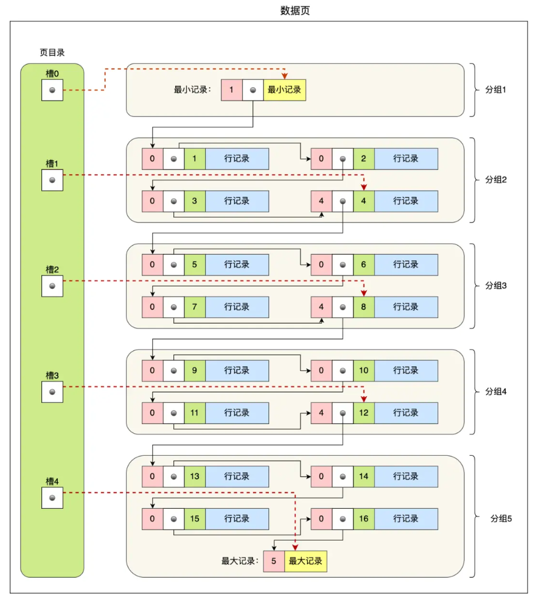

# 索引篇
## 1 索引的分类
|分类方法|具体类别|
|---|---|
|按照数据结构分类|Hash索引、B+tree索引、Full-Text索引|
|按物理存储分类|聚簇索引（主键索引）、二级索引（辅助索引）|
|按字段特性分类|主键索引、唯一索引、普通索引、前缀索引|
|按字段个数分类|单列索引、联合索引|

### 1.1 按数据结构分类
按照数据结构分类，可以将索引分为：Hash索引、B+tree索引、Full-Text索引。

#### 1.1.2 B+tree索引

B+tree索引是什么？
* B+tree索引是一种多叉树结构的索引，数据仅仅存放在叶子节点中，非叶子节点仅仅存放索引。
* 每一层父节点的索引值都会出现在下层节点的索引值中，因此在叶子节点中，包括所有的索引值信息。
* 每一个叶子节点包含两个指针，分别指向前一个叶子节点和后一个叶子节点

主键索引的B+tree索引进行查询的过程？
* 将需要检索的数据的主键值与根节点层各个主键值进行对比，确定下一层的节点
* 当到达第二层后，进行同样的对比逻辑，确定下一层的节点
* 当到达最后一层叶子节点后，找到对应索引值的数据

B+tree索引和磁盘I/O？
* 数据的索引和数据都是存储在磁盘中的，因此每访问一个B+tree节点，都是进行一次磁盘I/O，查询过程经历了几个节点，就是经历了几次磁盘I/O。
* B+tree存储千万级别的数据仅仅需要3-4层高度即可，这意味这种千万级别数据量的数据库种进行数据检索，仅仅需要3-4次磁盘I/O即可。
* 因此，B+tree索引结构相比与二叉树索引结构来说，最大的优势在于查询效率很高，即使在数据量很大的情况下，也仅仅需要3-4次磁盘I/O即可。

二级索引B++tree索引？
* 主键索引的非叶子节点中存储的是主键索引值，叶子节点中存储的是数据；二级索引的非叶子节点中存储的是二级索引值，叶子节点中存储的是主键值。
* 通过二级索引进行检索时，需要经过两个B+tree。先通过二级索引的B+tree检索到该数据对应的主键值，再通过主键索引的B+tree检索到该数据。
* **不过**，当需要检索的数据再二级索引的B+tree中就能检索到的，就不用再通过主键的B+tree，例如如下查询命令，`select id from table where product_id = 'No.1001';`

为什么MySQL的InnoDB选择B+tree结构作为索引的数据结构？
* B+tree与Btree。B+tree只在叶子节点中存储数据，因此B+tree的非叶子节点的数据量比Btree的更小，所以单个节点可以存储的索引更多，即在相同磁盘I/O的次数下可以检索更多的数据。
* B+tree与二叉树。对于有N个节点的B+tree树，其检索的复杂度为`logdN`，其中d为每一个节点可以存储的最大检索数量；对于有N个节点的二叉树，其检索的复杂度为`logN`。因此，对于相同的数据量，使用二叉树建立索引结构，其树的高度会非常高，需要进行多次磁盘I/O，使得检索速度降低。
* B+tree与Hash。Hash表在做等值查询时的速度非常快，但是其不适合做范围查询，也即B+tree比Hash有更加广泛的应用。

#### 1.1.3 Hash索引

#### 1.1.4 Full-Text索引

### 1.2 按物理存储分类
按照物理存储分类，可以将索引分为：聚簇索引（主键索引）、二级索引（辅助索引），其中：
#### 1.2.1 聚簇索引（主键索引）
* 聚簇索引（主键索引）。仅仅在叶子节点存储数据，在非叶子节点存储的均为主键值。
#### 1.2.2 二级索引（辅助索引）
* 二级索引（辅助索引）。在叶子节点中存储的是主键值，而不是实际数据，在非叶子节点存储的为对应的二级索引值。

所以，如果能在二级索引中查找到需要的数据，那么就不需要回表，这个过程就叫做覆盖索引；如果查询的数据不再二级索引中，那么就会在二级索引的叶子节点中找到对应的主键值，然后再检索主键索引，查找到对应的数据，这个过程就是回表。


### 1.3 按字段特性分类
按照字段特性分类，可以将索引分为：主键索引、唯一索引、普通索引、前缀索引。
#### 1.3.1 主键索引
主键索引就是建立在主键上的索引，通常会在创建表时一起创造，一张表只有一个主键索引，主键索引的索引值不能出现空。
```mysql
CREATE TABLE table_name (
    ...
    PRIMARY KEY (index_column_1) USING BTREE
);
```
#### 1.3.2 唯一索引
唯一索引就是建立在UNIQUE字段上的索引，一张表可以有多个唯一索引，唯一索引的索引值必须唯一，唯一索引的索引值可以为空。
```mysql
CREATE TABLE table_name (
    ...
    UNIQUE KEY (index_column_1, index_column_2, ...)
);
```
当完成建表后，可以使用以下命令进行唯一索引的建立。
```mysql
CREATE UNIQUE INDEX index_name
ON table_name(index_column_1, index_column_2, ...);
```
#### 1.3.3 普通索引
普通索引就是建立在普通字段上的索引，其既不为主键索引，也不为唯一索引
#### 1.3.4 前缀索引
前缀索引就是建立在字符类型字段前几个字段上的索引，可以建立前缀索引的字段类型为`char`、`varchar`、`binary`、`varbinary`的字段上。使用前缀索引的目的是减少索引占用的存储空间，提升查询效率。
### 1.4 按字段个数分类
按照字段个数分类，可以将索引分为：单列索引、联合索引。建立在单列上的索引称为单列索引，建立在多列上的索引称为联合索引。
#### 1.4.1 单列索引

#### 1.4.2 联合索引
将多个字段组合成一个索引，这种索引就叫做联合索引，创建联合索引的方式如下：
```mysql
CREATE INDEX product_no_number ON table_name(index_column_1, index_column_2);
```
对于联合索引的B+tree，其非叶子节点将联合索引使用的多个字段值作为索引值，其叶子节点存放的不是需要查询的数据，而是主键值。对于上述命令创建的联合索引，在查询时是先按`index_column_1`进行检索，再按`index_column_2`进行检索的，也就是联合索引的检索规则遵循**最左匹配原则**。

例如创建如下联合索引`(a, b, c)`：
* 下列检索条件下，符合最左匹配原则，会使用联合索引：
    * `where a = 1`
    * `where a = 1, b = 2, c = 3`
    * `where a = 1, b = 2`
* 下列检索条件下，由于不符合最左匹配原则，不会使用联合索引：
    * `where b = 2`
    * `where c = 3`
    * `where b = 2, c = 3`
* 对于联合索引，只有在最左的索引`a`相等的情况下，索引`b`是有序，而在`b`有序的情况下，索引`c`才是有序的。所以索引`b`和`c`是局部有序的，而索引`a`是全局有序的，这样在没有满足最左匹配原则的情况下，是无法利用联合索引的。

#### 1.4.3 联合索引和范围查询
在联合索引的范围查询中，并不是利用到了联合索引了，索引中的所有字段就利用到了联合索引，通过几个例子加以说明。
```mysql
SELECT * FROM t_table WHERE a > 1 AND b = 2
```
* 对于索引`a`来说，其是全局有序的，可以通过顺序查询找到第一个符合`a > 1`的索引；
* 但是对于索引`b`来说，其是局部有序的，对于所有满足`a > 1`的联合索引，`b`索引是无序的；
* 因此，范围查询`a > 1`是可以利用联合索引的，而`b = 2`则无法利用联合索引。

```mysql
SELECT * FROM t_table WHERE a >= 1 AND b = 2
```
* 对于上述命令，在检索时可以将其拆开成两个语句进行执行：`a = 1 and b = 2`和`a > 1 and b = 2`执行；
* 对于`a = 1 and b = 2`，索引`a`和`b`都能走联合索引；
* 对于`a > 1 and b = 2`，索引`a`可以走联合索引，但是索引`b`不可以走联合索引

```mysql
SELECT * FROM t_table WHERE a BETWEEN 2 AND 8 AND b = 2
```
* 不同的数据库软件对于BETWEEN的规定有所不同，对于mysql来说，使用`BETWEEN ... AND ...`相当于`... >= ... AND ... <= ...`，其是可以取到区间边界的。
* 因此上述命令相当于`SELECT * FROM t_table WHERE a >= 2 AND a <= 8 AND b = 2`，其可以拆分为`a = 2 AND b = 2`，`a > 2 AND a < 8 AND b = 2`，`a = 8 AND b = 2`。
* 对于`a = 2 AND b = 2`，索引`a`和`b`都能走联合索引；
* 对于`a > 2 AND a < 8 AND b = 2`，索引`a`可以走联合索引，但是索引`b`不可以走联合索引
* 对于`a = 8 AND b = 2`，索引`a`和`b`都能走联合索引；

```mysql
T * FROM t_user WHERE name like 'j%' and age = 22
```
* 对于索引`a`来说，其是可以使用联合索引的，其实际的检索区间为`[j, k)`，因此同样可以分为两条检索命令。
* 会定位到第一条符合`name`以`j`开头，`age = 22`的索引

#### 1.4.4 索引下推
对于联合索引 `(a, b)`，在执行 `select * from table where a > 1 and b = 2` 语句的时候，只有 a 字段能用到索引，那在联合索引的B+Tree找到第一个满足条件的主键值（ID 为 2）后，还需要判断其他条件是否满足（看 b 是否等于 2），那是在联合索引里判断？还是回主键索引去判断呢？
* 在 MySQL 5.6 之前，只能从 ID2 （主键值）开始一个个回表，到「主键索引」上找出数据行，再对比 b 字段值。
* 而 MySQL 5.6 引入的**索引下推优化**（index condition pushdown），其中的“下推”是指将条件判断下推到存储引擎层，可以在联合索引遍历过程中，对联合索引中包含的字段先做判断，直接过滤掉不满足条件的记录，减少回表次数。

当查询语句的执行计划里，出现了 Extra 为 `Using index condition`，那么说明使用了索引下推的优化。

#### 1.4.5 索引区分度
* 区分度是指某个字段 column 不同值的数除以表的总行数，计算公式为：`ditinct(column) / count(*)`
* 在实际开发过程中，对于联合索引，应当尽可能的让区分度大的索引排在前面，使得其尽可能多得被利用到检索过程之中。

#### 1.4.6 联合索引进行排序
对于`select * from order where status = 1 order by create_time asc`语句，如何进行优化以提高索引效率：
* 有的同学会认为，单独给 `status` 建立一个索引就可以了。
* 但是更好的方式是给 `status` 和 `create_time` 列建立一个联合索引，因为这样可以避免 MySQL 数据库发生文件排序。
* 因为在查询时，如果只用到 `status` 的索引，但是这条语句还要对 `create_time` 排序，这时就要用文件排序 `filesort`，也就是在 SQL 执行计划中，Extra 列会出现 `Using filesort`。
* 所以，要利用索引的有序性，在 `status` 和 `create_time` 列建立联合索引，这样根据 `status` 筛选后的数据就是按照 `create_time` 排好序的，避免在文件排序，提

## 2 索引的创建
索引最大的好处是提高查询速度，但是索引也是有缺点的，比如：
* 需要占用物理空间，数量越大，占用空间越大。
* 创建索引和维护索引要耗费时间，这种时间随着数据量的增加而增大。
* 会降低表的增删改的效率，因为每次增删改索引，B+tree为了维护索引有序性，都需要进行动态维护。

### 2.1 什么时候需要创建索引？
* 字段具有唯一性的限制，比如商品编码。
* 经常用`WHERE`进行检索的数据。
* 经常用`ORDER BY`和`GROUP BY`的字段，这样在查询的时候就需要再进行一次排序了，因为建立好B+tree索引的都是有序的。

### 2.2 什么时候不需要创建索引？
* `WHERE`和`ORDER BY`和`GROUP BY`不经常使用的字段，因为建立索引是需要耗费内存空间的，对于不起到定位作用的字段美哟建立索引的必要。
* 字段中存在大量重复值的数据，也就是区分度低的字段，不需要创建索引。
* 表数据太少的字段列，不需要创建索引。
* 经常更新的字段是不需要创建索引的，因为维护B+tree有序性是需要耗费时间的，这回影响到数据库的性能。

## 3 索引的优化
* 前缀索引优化
* 覆盖索引优化
* 主键索引最好自增
* 防止索引失效

### 3.1.1 前缀索引优化
前缀索引顾名思义就是使用某个字段中字符串的前几个字符建立索引，那我们为什么需要使用前缀来建立索引呢？
* 使用前缀索引是为了减小索引字段大小，可以增加一个索引页中存储的索引值，有效提高索引的查询速度。在一些大字符串的字段作为索引时，使用前缀索引可以帮助我们减小索引项的大小。
* 不过，前缀索引有一定的局限性，例如：
    * `order by` 就无法使用前缀索引，前缀索引只包含了列的一部分（例如前 5 个字符）。两个字符串的前 5 个字符相同，并不代表这两个字符串就是相等的，也不能确定它们的后续顺序；
    * 无法把前缀索引作为覆盖索引，前缀索引本身就是“残缺”的，它只存储了字段的一部分内容。
### 3.1.2 覆盖索引优化
覆盖索引是指 SQL 中 `query` 的所有字段，在索引 B+Tree 的叶子节点上都能找得到的那些索引，从二级索引中查询得到记录，而不需要通过聚簇索引查询获得，可以避免回表的操作。

假设我们只需要查询商品的名称、价格，有什么方式可以避免回表呢？
* 我们可以建立一个联合索引，即「商品ID、名称、价格」作为一个联合索引。如果索引中存在这些数据，查询将不会再次检索主键索引，从而避免回表。

所以，使用覆盖索引的好处就是，不需要查询出包含整行记录的所有信息，也就减少了大量的 I/O 操作。
### 3.1.3 主键索引最好自增
自增的主键索引通常指的是在创建数据库表时，将主键字段设置为 AUTO_INCREMENT（自动增长）属性。即便你显式插入数据时没有指定该字段的值，数据库也会自动为它生成一个递增的整数。

InnoDB创建主键索引默认为聚簇索引，数据被存放在B+tree的叶子节点上，也就是说，同一个叶子节点内的各个数据是按主键顺序存放的，因此每当有一条新的数据被插入时，数据库会根据主键将其插入到对应的叶子节点中去。

故，使用自增主键索引的原因如下：
* 减少页分裂和碎片。每次插入新的记录，主键值都比之前的大，所以新记录会直接追加到当前索引页的末尾，当一页写满了，就申请一个新的页继续写。这被称为“顺序插入”；如果主键是随机的，新记录的主键可能比当前页的最大值小，数据库就需要把它插到页的中间。如果该页已经满了，为了腾出空间，必须把该页分裂成两个页，并移动数据。这个过程叫页分裂，开销很大，而且会导致数据页利用率下降（碎片化）。

### 3.1.4 索引最好设置为`NOT NULL`
* 索引列存在NULL就会导致优化器在做索引选择的时候更加复杂，更加难以优化，因为可为NULL的列会使得索引、索引统计和值比较复杂，比如进行索引统计时，count会省略值为NULL的行。
* NULL值是一个没有意义的值，但是它会占用物理空间，所以会带来存储空间的问题，因为InnoDB存储记录的时候，如果表中存在允许NULL的字段，那么行格式中至少会用一个字节空间存储NULL值列表。
### 3.1.4 防止索引失效
* 当我们使用左或者左右模糊匹配的时候，也就是`like %xx`或者`like %xx%`这两种方式都会造成索引失效； 
* 当我们在查询条件中对索引列做了计算、函数、类型转换操作，这些情况下都会造成索引失效； 
* 联合索引要能正确使用需要遵循最左匹配原则，也就是按照最左优先的方式进行索引的匹配，否则就会导致索引失效。 
* 在`WHERE`子句中，如果在`OR`前的条件列是索引列，而在`OR`后的条件列不是索引列，那么索引会失效。

使用如下语句可以查看查询语句的执行计划：
```mysql
explain select * from table where id + 1 = 10;
```
对于执行计划，参数有：
* `possible_keys`：字段表示可能用到的索引；
* `key`：字段表示实际使用的索引，如果这一项为`NULL`，说明没有使用索引；
* `key_len`：表示索引的字段长度；
* `rows`：表示扫描的数据行数；
* `type`：表示数据扫描类型

常见的数据扫描类型：
|扫描类型|实际内容|
|---|---|
|`All`|全表扫描|
|`index`|全索引扫描|
|`range`|索引范围扫描|
|`ref`|非唯一索引扫描|
|`eq_ref`|唯一索引扫描|
|`const`|结果只有一条的主键或唯一索引扫描|

* `All`：最坏的情况，全表扫描。这意味着 MySQL 需要从头到尾读取整个表来找到你需要的行。
* `index`：全索引扫描。和 `All` 差不多，只不过 `index` 是对索引表进行全扫描。这样做的好处是不再需要对数据进行排序，但是开销依然很大。所以，要尽量避免全表扫描和全索引扫描。
* `range`：索引范围扫描。一般在 `WHERE` 子句中使用 `<`、`>`、`in`、`between` 等关键词，只检索给定范围的行，属于范围查找。**从这一级别开始，索引的作用会越来越明显，因此我们需要尽量让 SQL 查询可以使用到 range 这一级别及以上的 type 访问方式**。
* `ref`：非唯一索引扫描。表示采用了非唯一索引，或者是唯一索引的非唯一性前缀。返回数据返回可能是多条。因为虽然使用了索引，但该索引列的值并不唯一，有重复。这样即使使用索引快速查找到了第一条数据，仍然不能停止，要进行目标值附近的小范围扫描。但这比全表扫描好得多，因为索引是有序的，即便有重复值，也是在一个非常小的范围内扫描。
* `eq_ref`：唯一索引扫描。通常使用在多表联查中。比如，对两张表进行联查，关联条件是两张表的 `user_id` 相等，且 `user_id` 是唯一索引，那么使用 `EXPLAIN` 进行执行计划查看的时候，`type` 就会显示 `eq_ref`。
* `const`：结果只有一条的主键或唯一索引扫描。使用了主键或者唯一索引与常量值进行比较，比如 `select name from product where id=1`。

**注意**：`const` 类型和 `eq_ref` 都使用了主键或唯一索引，不过这两个类型有所区别，**`const` 是与常量进行比较，查询效率会更快，而 `eq_ref` 通常用于多表
## 4 数据页和 B+tree
### 4.1 InnoDB如何存储数据
数据库中的记录是按照行来存储的，但是数据库的读取并不以行为单位，否则一次读取只能处理一行数据，效率会很低。

因此InnoDB的数据是按照数据页为单位来读写的，也就是，当需要读一条记录的时候，并不是将这个记录本身从磁盘读出来，而是以页为单位，将其整体读入内存。

数据库的I/O操作的最小单位是页，InnoDB数据页的默认大小是16KB，意味着数据库每次读写都是以16KB为单位的，一次最少从磁盘中读取16KB的内容到内存中，一次最少把内存中16KB的内容刷新到磁盘中。


**数据页**包括7个部分：
|名称|内容|
|---|---|
|文件头（File Header）|表示页的信息。其中含有两个指针，分别指向上一个数据页和下一个数据页，连接起来的页相当于一个双向链表。|
|页头（Page Header）|表示页的状态信息|
|最大、最小记录（Infimum + Supermum）|两个虚拟的伪记录，分别表示页中的最小记录和最大记录|
|用户记录（User Records）|存储行记录内容|
|空闲空间（Free Space）|页中还没被使用的空间|
|页目录（Page Directory）|存储用户记录的相对位置，对记录起到索引作用|
|文件尾（File Tailer）|校验页是否完整|

数据页中的记录按照主键的顺序组成单向链表，单向链表的特点就是插入、删除非常方便，但是检索效率不高，最差的情况下需要遍历链表上的所有节点才能完成检索。

因此，数据页中有一个页目录，起到记录索引作用。

#### 4.1.1 页目录的创建


* 将所有的记录划分成几个组，这些记录包括最小记录和最大记录，打不包括标记为“已删除”的记录
* 每个记录组的最后一条记录就是组内最大的那条记录，并且最后一条记录的头信息中会存储该组一共有多少条记录，作为`n_owned`字段
* 页目录用来存储每组最后一条记录的地址偏移量，这些地址偏移量会按照先后顺序存储起来，每组的地址偏移量也被称之为槽，每个槽相当于指针指向了不同组的最后一个记录。
* 页目录就是由多个槽组成的，槽相当于分组记录的索引。然后，因为记录是按照主键值从小到大排序的，所以我们通过槽查找记录时，可以使用二分法快速定位要查询的记录在哪个槽，定位到槽后，再遍历槽内的所有记录，找到对应的记录，无需从最小记录开始遍历整个页中的记录链表。

以上面那张图举个例子，5 个槽的编号分别为 0，1，2，3，4，我想查找主键为 11 的用户记录：

* 先二分得出槽中间位是 (0+4)/2=2，2 号槽里最大的记录为 8。因为 11 > 8，所以需要从 2 号槽后继续搜索记录；
* 再使用二分搜索出 2 号和 4 槽的中间位是 (2+4)/2= 3，3 号槽里最大的记录为 12。因为 11 < 12，
* 以主键为 11 的记录在 3 号槽里；这里有个问题，“槽对应的值都是这个组的主键最大的记录，如何找到组里最小的记录？”比如槽 3 对应最大主键是 12 的记录，那如何找到最小记录 9。解决办法是：通过槽 3 找到 槽 2 对应的记录，也就是主键为 8 的记录。主键为 8 的记录的下一条记录就是槽 3 当中主键最小的 9 记录，然后开始向下搜索 2 次，定位到主键为 11 的记录，取出该条记录的信息即为我们想要查找的内容。
* 看到第三步的时候，可能有的同学会疑问，如果某个槽内的记录很多，然后因为记录都是单向链表串起来的，那这样在槽内查找某个记录的时间复杂度不就是 O(n) 了吗？

这点不用担心，InnoDB 对每个分组中的记录条数都是有规定的，槽内的记录就只有几条：

第一个分组中的记录只能有 1 条记录；
最后一个分组中的记录条数范围只能在 1-8 条之间；
剩下的分组中记录条数范围只能在 4-8 条之间。

### 4.2 B+tree 如何进行查询
### 4.3 聚簇索引和二级索引