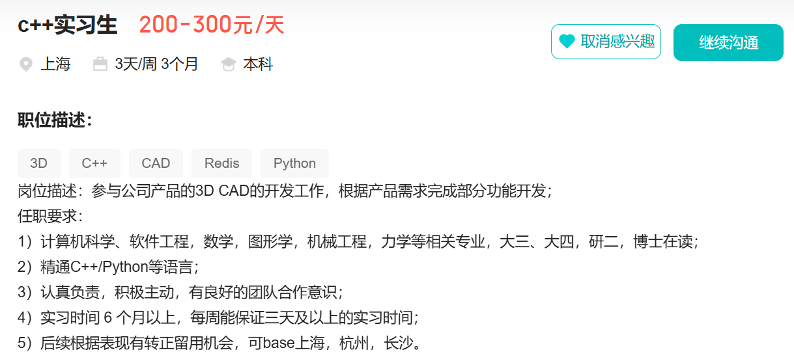
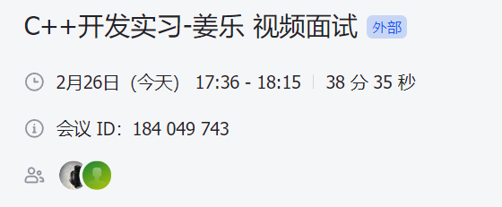

# 面试：子虔科技

## 问题回顾

* 你的学习路程是什么样的？说说你是如何自学的？
* 在求职的时候是如何确定求职方向的？
* 说说C++中智能指针有哪些？
* 说说`map`和`unordered_map`的区别？并总结它们适合的应用场景是什么？
* 简单介绍SmartStream这个项目的实现过程？
* 这个项目有进行量化指标的评估吗？
* 这个项目的来源是什么？网上开源的？还是科研中的？
* 简单展示你的一段代码，并且介绍一下它的功能？

## 自我评价
* C++基础这边掌握不好，需要加深巩固。
* 项目需要精进一下，需要增加量化评估的内容。